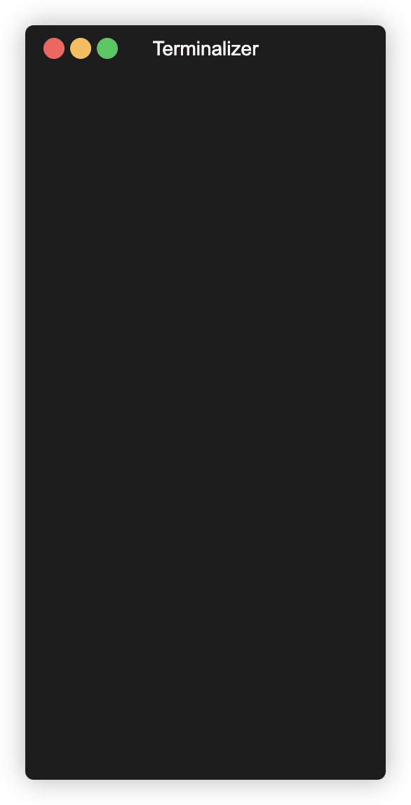

# API Practice Project

> Small, well-documented Express API used for learning API testing with Postman & Newman.

**Repository**: `API_testing_using_postman`

## Quick Summary
- Purpose: teaching and demonstrating HTTP, headers, cookies, JWT, and CRUD testing workflows.
- Tech: Node.js, Express, Postman collection, Newman, xlsx (test case export).
- Notable files: `server.js`, `routes/students.js`, `data/students.json`, `API_postman_collection.json`, `QA.postman_environment.json`, `SETUP.md`, `TEST_PLAN.md`.

## Features
- CRUD endpoints for `students` (file-backed JSON storage).
- JWT and cookie-based authentication endpoints and protected routes.
- Postman collection with automated tests and environment (`API_postman_collection.json`, `QA.postman_environment.json`).
- Newman-based CLI test runner configured in `package.json` (`npm run test:newman`).
- Generated test-case workbook: `Postman_Test_Cases_multisheet.xlsx`.

## Quickstart (local)
1. Install dependencies:
```bash
npm install
```
2. Start the server:
```bash
npm start
```
Server runs on `http://localhost:3000` by default.

3. Run the Postman/Newman tests (script already sets `base_url`):
```bash
npm run test:newman
```
Reports are generated under the `reports/` folder (`report.html`, `report.json`, `report.xml`).

4. Optional: open the Postman collection `API_postman_collection.json` and environment `QA.postman_environment.json` in Postman for interactive runs.

## Recommended Improvements (industry-standard)
- Add a concise `README` (this file) — done.
- Add CI: GitHub Actions to run `npm ci` and `npm run test:newman` and upload reports as artifacts.
- Add linting and formatting: `eslint` + `prettier` with config and `npm run lint`/`npm run format` scripts.
- Add a test reporter badge and status badge on the README (build/test passing). Use GitHub Actions status or Shields.io.
- Use environment secret management for CI (store secrets if any private tokens are required). For local dev, keep `QA.postman_environment.json` with non-sensitive defaults.
- Add `npm run start:dev` (already present as `dev`) and `npm run test` alias to run unit/integration tests if added later.
- Add unit tests for key logic (e.g., validation functions) using `jest` or `mocha` and CI integration.
- Add a small demo script or recorded GIF to show a successful Newman run; place it in `docs/`.
- Improve repository structure: move `data/` into `src/data` or add README note explaining persistence is file-backed and not for production.
- Add license file (`LICENSE`) and contributor guidelines (`CONTRIBUTING.md`) if you plan to accept contributions.

## How to Showcase This Project on LinkedIn
- Headline (short): "API Testing with Postman & Newman — Express CRUD + JWT & Cookie Auth".
- Post body: describe the problem you solved (teaching/testing), key technologies used, and what you implemented (collection, automated runs, reports, multi-sheet test-case export).
- Visuals: include a short GIF or screenshot of `reports/report.html` passing or the terminal running `npm run test:newman` with green checks.
- Metrics: share test coverage numbers, test counts, or CI passing badge. Example: "22 requests, 52 assertions — all passing".
- Links: include the GitHub repo link and a short video/demo (hosted on GitHub or Loom). Add a link to the Postman collection (shareable link) if public.
- Hashtags & mentions: #Postman #Newman #API #NodeJS #Express #Testing #DevOps

## Files of Interest
- `API_postman_collection.json` — Postman collection with tests.
- `QA.postman_environment.json` — environment variables (`base_url`, `jwtToken`, `createdStudentId`).
- `scripts/generate_xlsx.js` — script that builds `Postman_Test_Cases_multisheet.xlsx`.
- `SETUP.md` — step-by-step project setup guide.
- `TEST_PLAN.md` — high-level testing plan.

## Next Steps I Can Help With

If you want, I can now add a simple GitHub Actions workflow to run the Newman tests on each push and upload the `reports/` artifacts — would you like me to add that? ### API Testing Using Postman

## Demo

A short demo GIF showing `npm run test:newman` can be placed at `docs/demo.gif` and will be displayed here when present.



Instructions to record and produce the GIF are in `docs/DEMO_INSTRUCTIONS.md`. A helper script to render a `terminalizer` recording is available at `scripts/render_demo_with_terminalizer.sh`.


